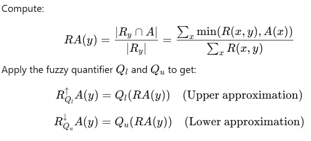
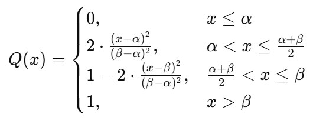
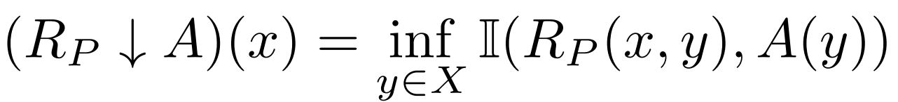
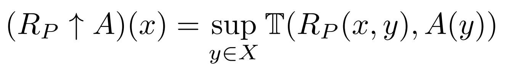
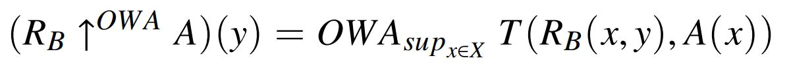
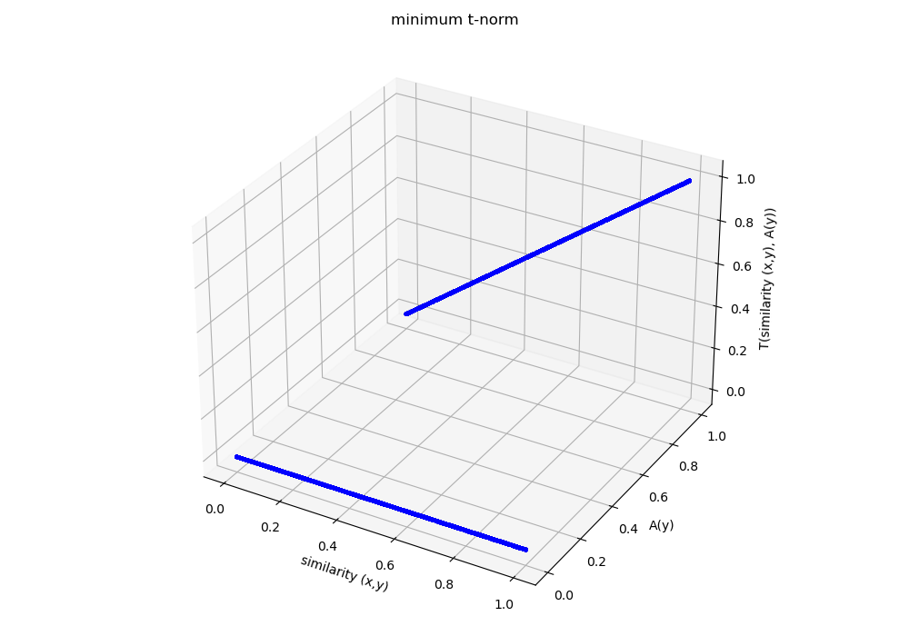
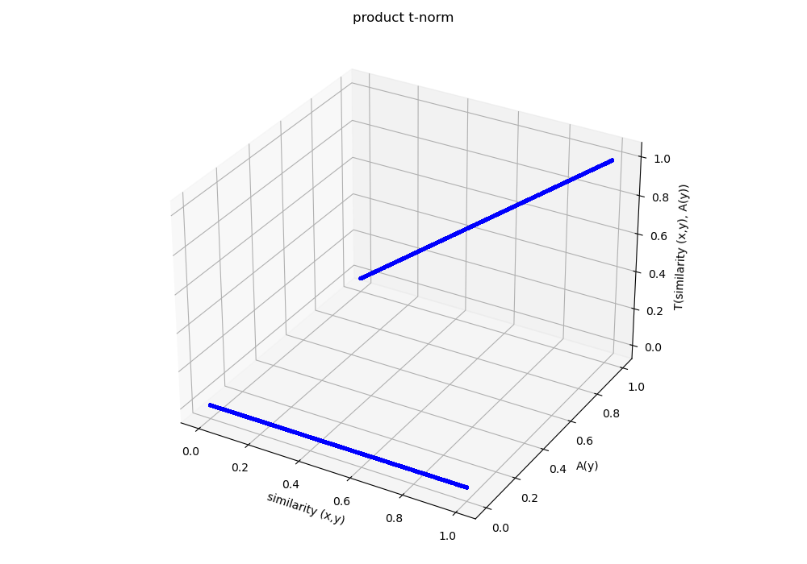
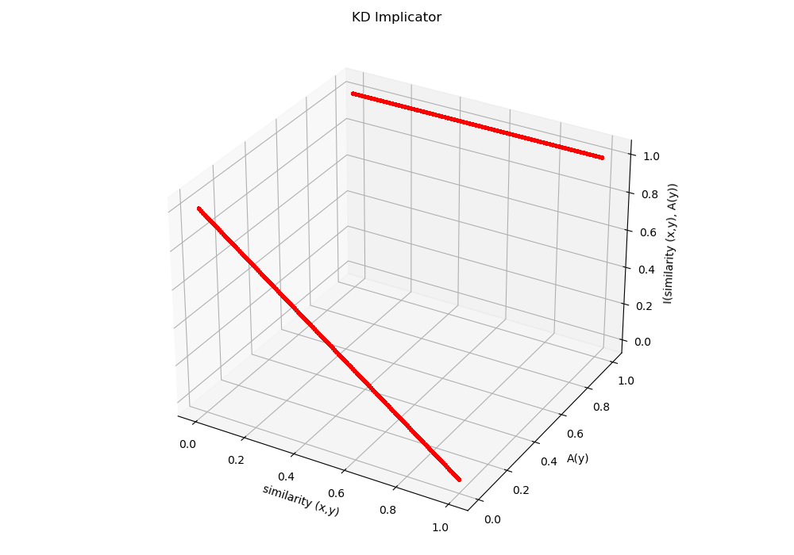
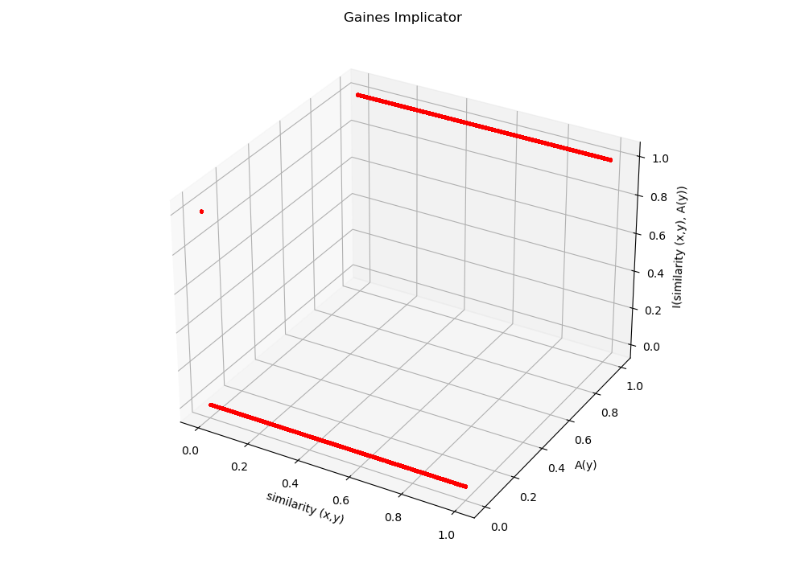

# For Developers
If you are a developer trying to extend FRsutils, please start here [Development Guidelines](lessons_learned_and_trainings/For_Developers.md)

# Installation

``` $pip install frsutils```

- Requirements
  - python
  - numpy 
  - imbalanced learn
  - scikit learn
  - pandas
  - colorlog
  - pytest (if you want to run unit tests)
  - zzz

# Fuzzy-Rough set utilities (Under development)

A basic Python library needed for fuzzy rough set calculations e.g.:

- lower approximation
- upper approximation
- positive region
- boundry region

## Algorithgms and containings

- Similarities (See [fuzzy similarities](similarities_info.md))
  - Linear
  - Gaussian
- Implicators (See [fuzzy implicators](implicators_info.md))
  - Gaines
  - Goedel
  - Kleene–Dienes
  - Reichenbach
  - Lukasiewicz
  - Gaines
  - Yager
  - Weber
  - Frank
  - Sugeno–Weber
- T-norms (See [fuzzy tnorms](tnorms_info.md))
  - Min tnorm
  - Product tnorm
  - Lukasiewicz tnorm
  - Yager tnorm
  - DrasticProduct tnorm
  - EinsteinProduct tnorm
  - HamacherProduct tnorm
  - NilpotentMinimum tnorm
- OWA weights (Ordered Weighted Average)(See [OWA](owa_weights_info.md))
  - Linear
  - Exponential
  - Harmonic
  - Logarithmic
- Fyzzy Quantifiers
  - Linear
  - Quadratic
- FR Models
  - ITFRS (Implicator/T-norm Fuzzy-Rough Sets)
  - OWAFRS (Ordered Weighted Average Fuzzy-Rough Sets) 
  - VQRS

## Fuzzy-rough oversampling
### FRSMOTE
- Compatible with scikit learn and its pipeline

## Notes (considerations on using FRsutils)
- All functions expect to get normalized scalar of normalized numpy arrays.
- Make sure the input dataset is normalized. This library expects all inputs to all functions are in range [0,1]
- This library will use all features of data instances to calculate the fuzzzy-rough measures.
- All datasets have 2 classes.
- Positive region, lower approximation, upper approximation,etc are calculated based on the class of each instance. Therefore, maximum calculations in POS is ignored and POS is equal to lower approximation value.

## Some technical information to remember
### In VQRS
#### lower and upper approximations for each instance: 


#### we use quadratic fyzzy quantifier:


### In ITFRS
#### lower approximation for each instance: 


#### upper approximation for each instance:


#### Since for the calculations of lower approximation, we calculate Inf which is basically a minimum, to exclude the same instance from calculations we don’t need anything because the main diagonal is set to 1.0 which is ignored by min operator. To be sure all is correct, inside code, we set main diagonal to 1.0

#### Since for the calculations of upper approximation, we calculate sup which is basically a maximum, to exclude the same instance from calculations we need to set the main diagonal to 0.0 which is ignored by max operator. Otherwise all upper approxamations will be 1.0.

#### In ITFRS, POS(x) = lower_approximation(x) where x  is a data instance, and datasets having crisp classes.

### In OWAFRS
#### lower approximation for each instance: 


#### upper approximation for each instance:


#### Since for the calculations of lower approximation, we calculate soft Inf which is basically a product, to exclude the same instance from calculations we set the main diagonal to 0.0

#### Since for the calculations of upper approximation, we calculate soft sup which is basically a product, to exclude the same instance from calculations we need to set the main diagonal to 0.0 which is ignored by max operator. Otherwise all upper approxamations will be 1.0.

#### In OWAFRS, POS(x) = ????????????????????????


### OWA weights
OWA weights are used for softening strict operators: inf and sup. They are a set of weights ordered in ascending or descending based on the use. they are shown by W={w1, w2,...wn} and they are multiplied by  vector V{v1,v2,...vn}. Assume V is always ordered in dissending order, namely v1 is the max and vn is the min.
- For inf calculations, which is basically a minimum, higher values of W will be multiplied by lower values of V. This means W is ordered as ascending order; Namely w1 is the smallest value and wn is the biggest value in vector W. Then, OWA(W,V) = w1.v1 + w2.v2 + ... wn.vn
- For sup calculations, which is basically a maximum, higher values of W will be multiplied by higher values of V. This means W is ordered as decending order; Namely w1 is the biggest value and wn is the smallest value in vector W. Then, OWA(W,V) = w1.v1 + w2.v2 + ... wn.vn

### tnorms
- works on 1D vectors (for aggregating the values to a scalar in similarity calculations)
- works on nxnx2 maps for fast calculations
- min tnorm and product tnorm will act the same if one of the input parameters takes the binary values; So, no matter which one you use, they provide the same reults




------



------
### Implicators
- Since in this library, A(y) in implicators--if instance x has the same class of instance y, is used, therefore different implicators boil down to the same thing:
  - Goedel and Gaines produce the same results
  - KD, Reichenbach and Luk also produce the same results
- implicators work on scalar but can be vectorized with np.vectorize()
- implicators do not generate the same values for these (0,0) , (1,0) , (0,1) , (1,1). Their behavior is different. Do not draw a general conclusion on them.


------


------



------


------



------

<!-- | sim(x,y) | A(y) | Implicator Gaines | Implicator Goedel | Implicator KD | Implicator Reichenbach | Implicator Luk | -->
<!-- |------|------|------|------|------|------|------| -->
<!-- | 0.8   |  0.0   |  0.0  |  0.0  |  0.2   |  0.2   |  0.2  | -->
<!-- |  x   |  x   |  x   |  x   |  x   |  x   |  x   | -->

where x, y are two data instances; A(y) means if the instance y has the same class as X and returns 0.0 or 1.0. 

## Docs
- We use Doxygen-style (Javadoc-like) Python Docstrings and documents are generated by Doxygen
- To see online documentations, please visit [online documentations](https://mehi64.github.io/FRsutils/)

## How to run tests
These are two ways:
- use pytest and it finds and runs all tests
- If you want to run tests in debug mode, find and run the file experimental_tests.py (Make sure all functions in test files are called in this file. Maybe some are forgotten)
- For more information on test procedures, please refer to [test procedures](tests/test_procedures.md)

## Technical decisions justification
- Since data checking slows down the running of experiments, we don't check if data is in the correct range in each function.

## TODO:
- Add tests for tnorms with non-binary masks
- Implemene and debug VQRS (Vaguely Quantified Rough Sets)
- Change the code to get a class to calculate lower and upper approximations + POS regarding a single class of Y.

## License

This project is licensed under the AGPL-3.0 License. See the [LICENSE](./LICENSE) file for details.


## How to Cite us in your research papers

If you use this library in your research, please cite it as follows:

**APA** :  
> Mehran Amiri. (*2025*). *FRsutils* (Version 0.0.1) [Computer software]. https://github.com/mehi64/FRsutils

**BibTeX** (for LaTeX users):
```bibtex
@software{Mehran_Amiri_FRsutils_2025,
  author = {Amiri, Mehran},
  title = {FRsutils},
  url = {https://github.com/mehi64/FRsutils},
  version = {0.0.1},
  year = {2025}
}```


