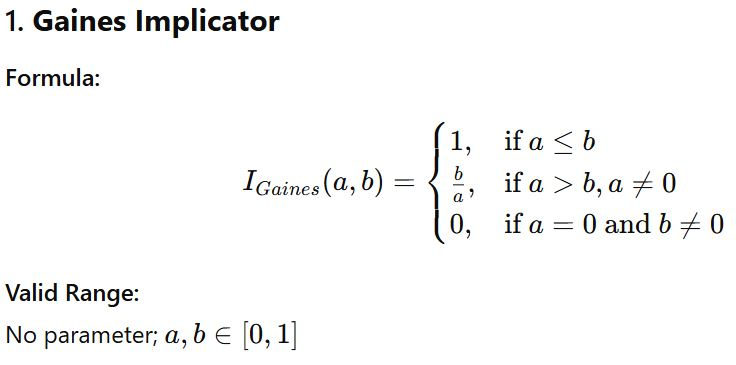
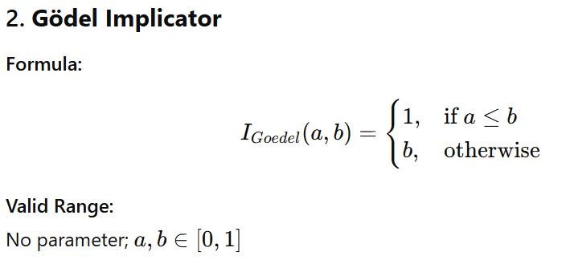
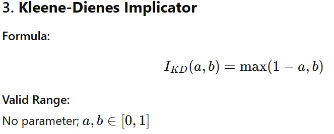
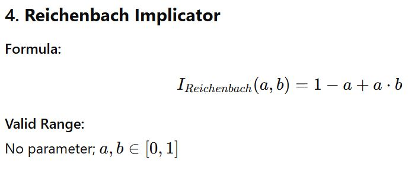
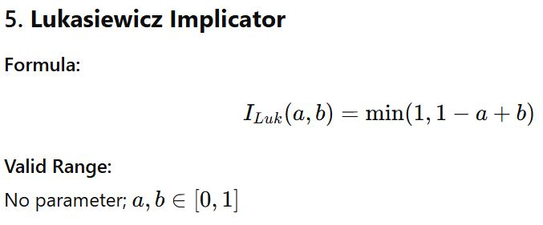
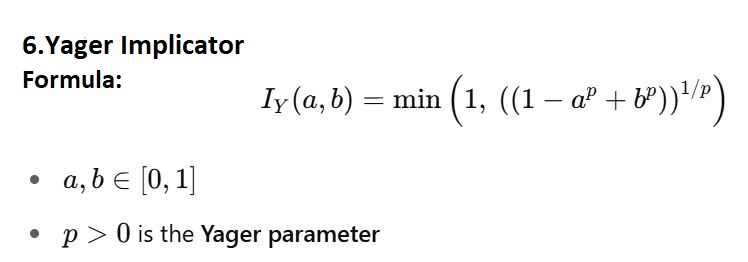
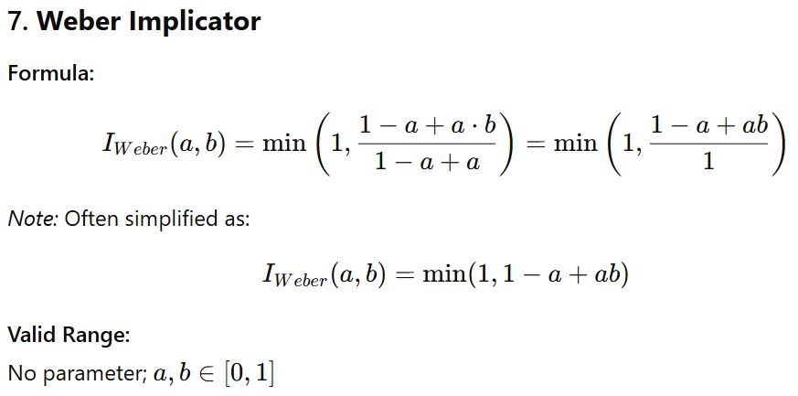
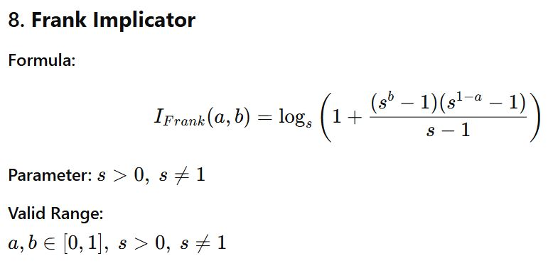
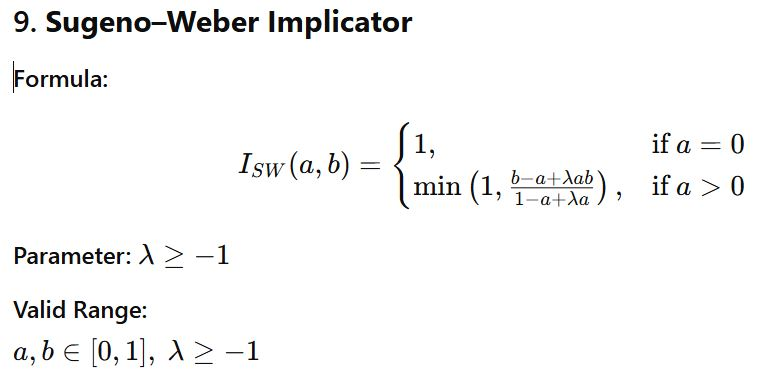

# Fuzzy Implicators

This document provides a list of commonly used fuzzy implicators, their formulae, valid parameter ranges, and references.

## Implicators' equation

<!--Gaines -->

------

<!--Gödel -->

------

<!--Kleene–Dienes-->

------

<!--Reichenbach-->

-----

<!--Lukasiewicz-->

-----

<!--Yager-->

-----

<!--Weber-->

-----

<!--Frank-->

-----

<!--Sugeno–Weber-->

  - 
  - 
  - 
  - 

## References (must be checked)

|Implicator	|Reference|
|------|------|
|Gaines|Gaines, B. R. (1978). Fuzzy and probability uncertainty logics. Information and Control, 38(2).|
|Gödel|Gödel, K. (1932). Zum intuitionistischen Aussagenkalkül. (Defined in t-norm form later.)|
|Kleene-Dienes|Kleene, S. C. (1952). Introduction to Metamathematics (linked with Dienes' psychological logic).|
|Reichenbach|Reichenbach, H. (1944). Philosophic Foundations of Quantum Mechanics|
|Lukasiewicz|Łukasiewicz, J. (1920). On Three-Valued Logic|
|Yager|Yager, R. R. (1980). On a general class of fuzzy connectives. Fuzzy Sets and Systems|
|Weber|Weber, S. (1983). A general concept of fuzzy connectives, negations, and implications. FSS|
|Frank|Frank, M. J. (1979). On the simultaneous associativity of F(x, y) and x+y−F(x, y). Aequationes Math|
|Sugeno–Weber|Sugeno, M. & Weber, M. (1986). A new approach to fuzzy reasoning. IJGS|