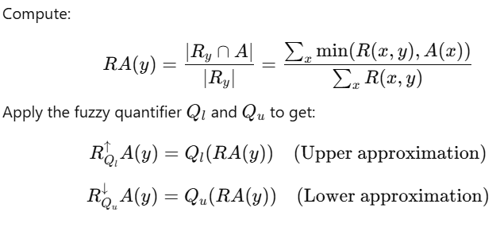
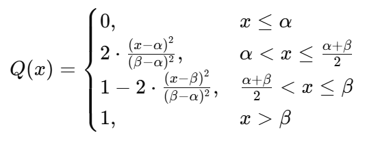

# VQRS model

## 1.Introduction

---

## 2. Intuition

---

## 3. Definitions

Let:

  - U be the universe of discourse.
  - X be a fuzzy set in U.
  - R(x, y) be the fuzzy similarity (or tolerance) between elements x and y.
  - μ_X(y) be the membership degree of y in fuzzy set X.
  - I be a fuzzy implicator.
  - T be a t-norm.
  - OWA be a normalized weight vector of length n.

**Lower Approximation in OWAFRS**

**Upper Approximation in OWAFRS**

---

### In VQRS
#### lower and upper approximations for each instance: 

#### we use quadratic fyzzy quantifier:

